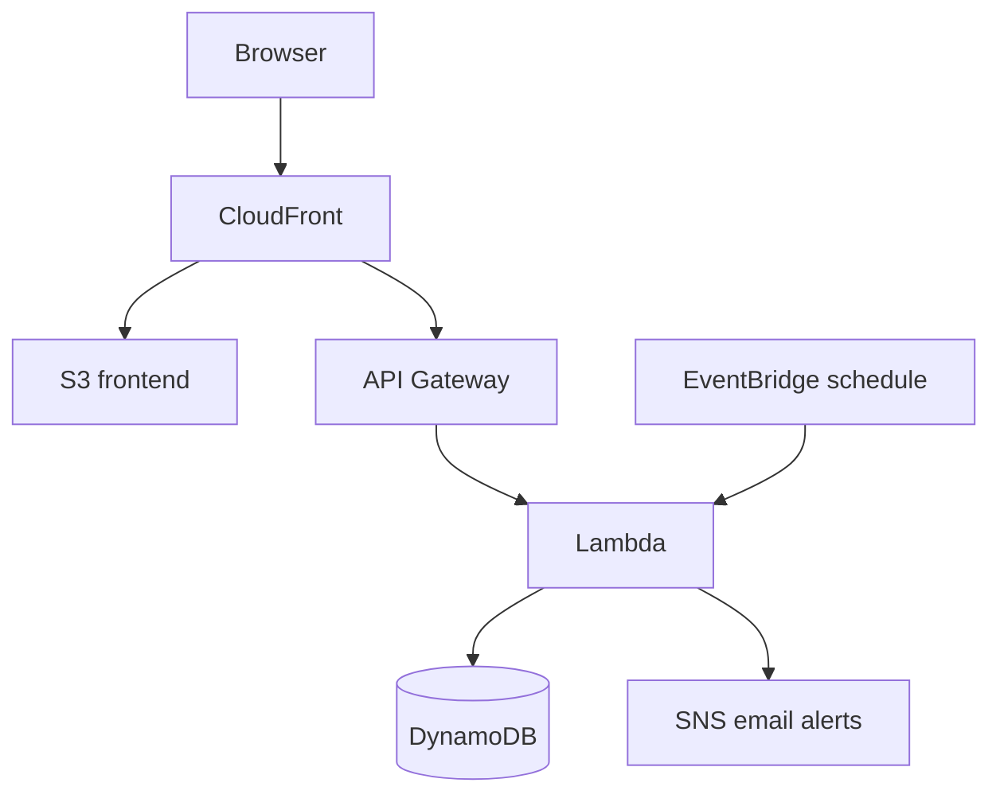

# CloudPulse

CloudPulse is a full-stack uptime and latency monitoring platform. It checks public websites and APIs, stores recent history, calculates availability metrics, and sends outage and recovery alerts from a serverless AWS deployment.

## Highlights

- Real HTTP availability and response-time checks
- Responsive status dashboard with recent-history visualization
- Local SQLite persistence and dependency-free Python API
- AWS Lambda checks invoked on demand and every five minutes
- DynamoDB history with automatic 30-day expiration
- SNS alert after two consecutive failures and on recovery
- Private S3 frontend delivered through CloudFront
- Terraform-managed infrastructure and GitHub Actions CI
- URL validation that blocks credentials and non-public destinations

## Architecture



The local development server exposes the same `/api` routes and stores data in SQLite, so the frontend does not need environment-specific code.

## Technology

| Layer | Local development | AWS deployment |
|---|---|---|
| Frontend | HTML, CSS, JavaScript | S3 + CloudFront |
| API | Python `http.server` | API Gateway + Lambda |
| Storage | SQLite | DynamoDB |
| Scheduling | Manual checks | EventBridge |
| Alerts | — | SNS |
| Infrastructure | — | Terraform |
| CI | `unittest` + Node syntax check | GitHub Actions |

## Run locally

Requirements: Python 3.11 or newer. No third-party runtime packages are required.

```bash
git clone https://github.com/YOUR-USERNAME/cloudpulse.git
cd cloudpulse
python3 -m venv .venv
source .venv/bin/activate
python -m backend.server
```

Open [http://localhost:8000](http://localhost:8000). The local database is created as `cloudpulse.db` and is ignored by Git.

Run the automated tests:

```bash
python -m unittest discover -s tests -v
node --check frontend/app.js
```

## API

| Method | Route | Purpose |
|---|---|---|
| `GET` | `/api/health` | Health check |
| `GET` | `/api/endpoints` | List monitors and recent history |
| `POST` | `/api/endpoints` | Create and immediately check a monitor |
| `DELETE` | `/api/endpoints/{id}` | Delete a monitor and its history |
| `POST` | `/api/checks/run` | Check all configured endpoints |

Example request:

```bash
curl -X POST http://localhost:8000/api/endpoints \
  -H "Content-Type: application/json" \
  -d '{"name":"Example","url":"https://example.com"}'
```

## Deploy to AWS

Prerequisites:

- An AWS account with billing alerts and MFA configured
- AWS CLI authenticated with a deployment role or IAM Identity Center
- Terraform 1.6 or newer

```bash
cd infrastructure
cp terraform.tfvars.example terraform.tfvars
# Edit terraform.tfvars and set your alert email.
terraform init
terraform fmt -check
terraform validate
terraform plan
terraform apply
```

Terraform prints `cloudpulse_url` after deployment. If an alert email was configured, confirm the SNS subscription from the email AWS sends. CloudFront deployment can take several minutes.

To upload later frontend changes:

```bash
terraform apply
aws cloudfront create-invalidation \
  --distribution-id YOUR_DISTRIBUTION_ID \
  --paths "/*"
```

Destroy the cloud resources when they are no longer needed:

```bash
terraform destroy
```

## Reliability decisions

- A service is online for HTTP responses below 400 and offline otherwise.
- Uptime and average latency on the dashboard use the 20 most recent checks.
- An outage notification is sent on the second consecutive failure, limiting noise from brief network errors.
- A recovery notification is sent when an offline endpoint responds again.
- DynamoDB TTL removes check history after 30 days.
- Lambda concurrency and API Gateway request rates are limited to constrain accidental usage.

## Security and scope

CloudPulse accepts only public HTTP and HTTPS endpoints and rejects credential-bearing URLs and private IP ranges. The included deployment is intended as a portfolio demonstration. Before exposing a multi-user production service, add authentication, per-user authorization, stronger abuse controls, and pagination for large datasets.

## Future improvements

- Amazon Cognito authentication and per-user monitors
- Configurable check intervals and latency thresholds
- Custom domains and Route 53 health checks
- Longer-term CloudWatch metrics and percentile latency charts
- Webhook, Slack, and SMS notification channels

## License

MIT
